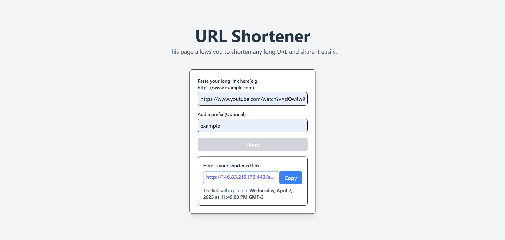

# URL Shortening Service

This repository contains the full-stack implementation of a **URL shortening service**, divided into two main parts:

## 📦 Project Structure

```
.
├── api/       # Backend service built with FastAPI
├── front/     # Frontend application built with React
```

### 🔧 `api/` – Backend (Python + FastAPI + PostgreSQL)

The `api` directory contains the backend service responsible for:

- Handling URL creation and redirection logic.
- Communicating with a **PostgreSQL** database to store and retrieve data.
- Serving a RESTful API via **FastAPI**.

For more details on API endpoints, environment setup, and database configuration, check the `api/README.md`.

### 🖥️ `front/` – Frontend (React + Vite + TailwindCSS)

The `front` directory contains the frontend user interface of the application.  
It is developed using **React** with **Vite** for fast development and **TailwindCSS** for styling.

This part of the project allows users to:

- Input a long URL and receive a shortened version.
- View basic feedback and navigation.
- Interact with the shortening service in a clean and modern UI.

For more details on setup and usage, check the `front/README.md`.

## 🧪 How It Works

The frontend sends requests to the backend to shorten URLs and handles redirection using the short paths.  
The backend handles the logic, validation, and persistence of the data.

## 🚀 Beta Access

The beta version of this service is available for use at:

👉 [http://146.83.216.176/](http://146.83.216.176/)

URL access analytics are available at:

👉 [http://146.83.216.176/443/urls](http://146.83.216.176/443/urls)

More details about each visit are logged in the API, which records every request to shortened URLs.

## 🧩 Desafío

The main challenge was, interestingly, implementing a copy-to-clipboard button.
I decided not to include it because the current browser API requires HTTPS for this functionality, due to security reasons.

Attached is an image of the solution I was aiming for:

